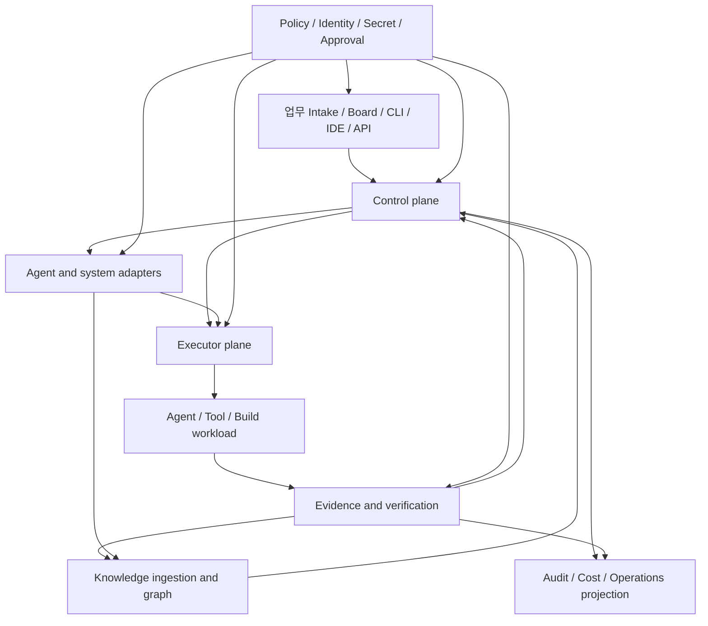

# Cross-platform 사내 AX 에이전트 플랫폼 reference architecture

[지식 베이스 홈](./index.md) · [지속 컨텍스트](./ax-platform-context.md) · [플랫폼 범위 결정](./decisions/AX-AD-001-cross-platform-core.md) · [플랫폼 구현 청사진](./platform-blueprint.md) · [도구 카탈로그](./tools/catalog.md) · [프로필 커버리지](./tools/coverage.md) · [지식 그래프 스키마](./knowledge-graph-schema.md)

이 문서는 단일 도구 조합이나 구매 목록이 아니라 사내 AX용 맞춤 플랫폼의 설계 기준선이다. 34개 fixed-SHA 조사 결과를 `Borrow/Adapt/Avoid/Build` 재료로 사용하되, 회사 고유 조건이 결정되기 전에는 제안 상태를 유지한다. 현재 증거 ceiling은 문서·정적 코드 통합 `V2`; build/runtime/E2E/운영 적합성은 미검증이다.

## Architecture principles

1. control plane의 durable state가 source of truth다. terminal 문자열, agent 자기보고와 UI card는 파생 관찰이다.
2. task readiness, atomic claim, lease/generation, process lifecycle, completion, verification, approval과 external write를 분리한다.
3. Windows native와 Linux native executor를 모두 first-class core로 둔다. Windows는 ConPTY·Job Object·long path·CRLF, Linux는 PTY·process group/session·signal·cgroup/systemd scope·permission/symlink/case sensitivity를 명시적 계약과 fixture로 다룬다.
4. ACP/typed protocol을 우선하고 CLI/PTY는 capability가 낮은 adapter로 격리한다.
5. evidence와 policy는 부가 로그나 UI 기능이 아니라 독립 계층이다. 누락·stale·우회 가능 상태는 fail-closed한다.
6. Windows native, Linux native, WSL, container, SSH와 cloud sandbox가 같은 인터페이스를 구현해도 process·filesystem·isolation·egress·resume semantics의 차이는 capability profile에 드러낸다. WSL/container/remote guest를 host-native 증거로 대체하지 않는다.
7. secret 원문은 task state와 knowledge graph에 넣지 않는다. audience가 좁고 짧게 사는 credential을 trusted broker가 주입한다.
8. 도구 조사 결과와 회사 결정을 분리한다. Capability는 evidence source를 갖고, AX Need와 Architecture Decision은 owner 승인과 assumption 상태를 갖는다.

## Layered reference model

| Layer | 최소 책임 | 명시적 경계 | 주 evidence source |
|---|---|---|---|
| Control plane | Task/Run/Event, dependency DAG, ready 계산, atomic claim, lease/generation, cancellation, reconciliation, resource/merge lane | AI planner가 durable state를 직접 덮어쓰지 않음; UI projection을 source of truth로 쓰지 않음 | agtx·Taskplane·Beads·Agent Orchestrator·Gas Town 프로필의 fixed-SHA Claims (`V2`) |
| Executor | 공통 command/event/cancel/artifact contract, Windows/Linux native process·PTY lifecycle, worktree와 non-file resource lease, environment fingerprint, local/remote provider contract | worktree를 security sandbox로 과장하지 않음; WSL/container/remote guest를 host-native 증거로 세지 않음 | Orca·Emdash·Container Use·E2B·Vercel·Cloudflare 조사 (`V1/V2`; 기존 Windows 최대 legacy `W1`, Linux 실행 evidence 없음) |
| Adapter | ACP/typed session·capability·permission·cancel, CLI/PTY fallback, SCM/CI/ticket/message connector | heuristic adapter는 confidence와 unsupported capability를 숨기지 않음 | ACP·acpx·AgentAPI·Codex·Buzz·gh-aw fixed-SHA Claims |
| Evidence | structured receipt, artifact/log hash, independent verifier, fresh-base diff/test, failure evidence, provenance | completion report ≠ verified; CI ≠ deploy/production | schema Evidence contract와 planning acceptance; 현재 실행 evidence 없음 |
| Policy | identity, RBAC/ABAC, approval, secret audience, egress, retention, model/data policy, external write gate | policy 누락·stale approval·우회 flag는 허용으로 해석하지 않음 | gh-aw·sandbox·gateway 조사와 사내 미결정 `AX-D001~D012` |
| Knowledge ingestion | manifest/submodule provenance, ToolVersion/observation/snapshot 분리, Claim/Evidence graph, decision/roadmap linkage | live upstream 관찰이 fixed Claim을 덮어쓰지 않음; private secret/endpoint 저장 금지 | [지식 그래프 스키마](./knowledge-graph-schema.md)와 [하이브리드 정책](./ax-platform-context.md#hybrid-source-policy-for-future-targets) |

## Minimal core and optional extensions

### Minimal core

| Core capability | 최소 구현 | 첫 검증 gate |
|---|---|---|
| Durable task/run/event kernel | SQLite WAL 또는 동등한 transactional store, idempotency key, append/reconcile 규칙 | restart·duplicate event fixture에서 상태 일관성 |
| Mechanical scheduler | dependency/resource gate, compare-and-set claim, lease expiry와 generation fencing | 20-task DAG에서 duplicate claim 0 |
| Common executor contract | command/environment, structured stdio·PTY event, capability negotiation, cancel/timeout/kill-tree, workspace/resource lease, artifact/receipt와 environment fingerprint | Windows/Linux 동일 conformance suite에서 unsupported capability가 명시적으로 fail-closed |
| Windows native executor | ConPTY, Job Object, process-tree cancel, staged worktree, port/db/device resource lease, long path와 CRLF fixture | 실제 Windows `P2`, orphan process 0 |
| Linux native executor | PTY, process group/session, signal propagation, cgroup 또는 systemd scope, staged worktree, port/db/device resource lease, permission/symlink/case fixture | 실제 Linux `P2`, orphan process 0 |
| Primary typed agent adapter | capability negotiation, session identity, permission/cancel/receipt | adapter conformance와 unsupported fail-closed |
| Evidence/verifier lane | worker와 분리된 command, artifact hash, base/head, environment, exit code | false-complete fixture 차단 |
| Human approval/write gate | proposal과 credential-bearing SCM/external write 분리 | stale/tampered proposal 100% 차단 |
| Audit and knowledge record | actor/run/profile/model/environment/provenance와 Claim/Evidence linkage | 누락 필드 gate, secret redaction fixture |

Minimal core는 remote sandbox, mobile relay, 자연어 coordinator나 graph DB가 없어도 local AX task를 신뢰 가능하게 실행·검증할 수 있어야 한다.

### Optional extensions

| Extension | 추가 조건 | core와의 관계 |
|---|---|---|
| WSL/SSH/container/cloud executor | data class·egress·secret·residency 결정과 provider conformance | native Windows/Linux core와 구분되는 capability-limited provider 구현 |
| Multi-provider/model router | model 허용 목록, 비용·latency·fallback과 data policy | task policy가 provider routing을 제한 |
| Signed relay/mobile/desktop control | identity binding, replay protection, lost-device/revocation, message retention | provenance 있는 intake일 뿐 privileged write 우회 경로가 아님 |
| Event automation | trigger trust, read/write 분리, safe-output parser와 approval | proposal 생성과 external action을 분리 |
| Sandbox snapshot/fork/preview | snapshot confidentiality, lifecycle/TTL, egress/DNS와 cleanup | resource lease와 evidence manifest에 연결 |
| Advanced planner/knowledge graph | query use case, conflict resolution, human override | mechanical scheduler와 승인 gate의 권위를 대체하지 않음 |
| HA/central fleet operations | RTO/RPO/SLO, tenant isolation, on-call과 disaster recovery | local core에서 검증된 reconciliation 계약 확장 |

## Capability to AX decision traceability

아래 관계는 설계 후보이며 승인된 회사 결정이 아니다. `Source`는 현재 최대 `I2/V2` 정적 근거이며 기존 Windows 표기는 legacy `W0~W1`이다. Linux native 실행 근거는 아직 없다.

| Capability | AX Need | Architecture Decision | RoadmapItem | Evidence source / ceiling |
|---|---|---|---|---|
| dependency DAG and wave/lane | 복수 AX 업무의 선후관계·병렬성 통제 | `AD-PROP-001`: AI 계획과 기계적 ready 계산 분리 | `RM-P0-task-schema`, `RM-P2-dag-scheduler` | agtx·Taskplane profiles; `I2/V2`, Taskplane `W1` narrow |
| atomic claim + lease/generation fencing | 중복 실행·stale worker 방지 | `AD-PROP-002`: transactional claim과 generation token 직접 구현 | `RM-P1-claim-lease`, `RM-P3-reconciliation` | Beads는 atomic-ish 참고; 실제 concurrent atomicity 미검증 `V2` |
| Native process containment | Windows/Linux host에서 취소·crash 후 process 회수 | `AD-PROP-003`: 공통 executor contract 아래 ConPTY+Job Object와 PTY+process group/cgroup 구현 분리 | `RM-P1-windows-executor`, `RM-P1-linux-executor`, `RM-P5-platform-regression` | Windows 정적 경로 최대 legacy `W1`; Linux와 양쪽 runtime `P2/P3` 없음 |
| typed session/capability protocol | agent별 기능 차이와 취소·권한을 예측 가능하게 처리 | `AD-PROP-004`: ACP 우선, CLI/PTY fallback 격리 | `RM-P0-adapter-contract`, `RM-P1-primary-adapters` | ACP·acpx·AgentAPI profiles `I2/V2`; runtime 미검증 |
| derived state projection | 작업·PR·CI·review 상태를 한 화면에서 추적 | `AD-PROP-005`: event replay projection, source events 보존 | `RM-P1-projection`, `RM-P3-rebuild-test` | Agent Orchestrator daemon/desktop projection `I2/V2/W1` |
| independent verification | agent 자기보고와 실제 완료를 분리 | `AD-PROP-006`: worker와 verifier identity/run 분리 | `RM-P3-verifier`, `RM-P3-false-complete-fixture` | planning evidence contract; 제품 runtime evidence 없음 |
| signed collaboration and task memory | 사람·agent 협업 provenance와 비동기 handoff | `AD-PROP-007`: relay와 local queue를 다른 trust domain으로 분리 | `RM-P2-coordination`, optional `RM-P4-relay` | Buzz `W1` static; squad Windows 후보 정적 근거, runtime 없음 |
| intent/spec versus execution graph | 요청 변경과 실행 이력의 추적성 | `AD-PROP-008`: immutable intent revision과 run linkage | `RM-P0-intent-schema`, `RM-P2-task-memory` | sudocode/Beads profiles `I2/V2`; Windows `W1` 후보 정적 |
| read-only proposal / guarded write | 자동화가 외부 시스템을 과권한으로 변경하는 위험 축소 | `AD-PROP-009`: agent proposal과 write executor·approval 분리 | `RM-P4-safe-output`, `RM-P4-threat-fixtures` | gh-aw `I2/V2/W1` CLI; approve bypass와 proxy 한계 명시 |
| fixed-version knowledge provenance | 설계 지식의 재현성과 drift 관리 | `AD-PROP-010`: hybrid submodule/manifest + Claim/Evidence graph | `RM-K0-profile-coverage`, `RM-K1-generated-index` | 이 저장소 `.gitmodules`, gitlinks, profiles; `I2/V2` document integration |
| budget/concurrency telemetry | 부서별 비용·capacity 통제 | `AD-NEEDED-011`: chargeback·quota 정책 결정 후 구현 | `RM-P4-budget-policy` | 회사 입력 `AX-D010` unknown; 실행 cost/latency evidence 없음 |

## Using Borrow / Adapt / Avoid / Build

| 분류 | architecture에서의 사용법 | 예시 |
|---|---|---|
| Borrow | fixed-SHA Claim으로 확인된 작은 계약·상태 전이를 직접 참고 | dependency gate, typed capability negotiation, derived projection |
| Adapt | 회사 조건과 대상 OS executor에 맞춰 의미를 좁히고 검증 계획을 붙임 | tmux/WSL orchestration을 Windows ConPTY/Job Object 또는 Linux PTY/process-group lifecycle로 변형 |
| Avoid | fail-open, 자기보고 완료, durable identity 없는 in-memory routing, 우회 가능한 safety lock을 배제 | warning-only approval, PTY 화면을 verified state로 사용 |
| Build | 핵심 신뢰 경계이고 조사 도구에 충분한 보장이 없는 capability를 직접 구현 | atomic claim, generation fencing, evidence package, policy/write gate |

AGPL 등 license 제약이 있는 구현은 아이디어를 clean-room 설계 재료로만 쓸 수 있다. license 파일·metadata 불일치가 있으면 둘을 병기하고 법적 결론을 추정하지 않는다.

## Fail-open / fail-closed decision points

| 경계 | fail-closed 기본 | 알려진 함정 |
|---|---|---|
| claim/lease | storage transaction과 generation 일치 전 실행 금지 | Kanban/dependency UI가 durable atomic claim을 뜻하지 않음 |
| completion | required receipt와 verifier evidence 없으면 `unverified` | agent message, terminal idle, green 일부 test를 완료로 오인 |
| approval | 대상 hash/head/scope가 바뀌면 재승인 | warning·lock이 `--approve` 같은 우회 경로를 막지 못할 수 있음 |
| external write | read-only proposal과 별도 최소권한 executor | agent runtime에 SCM/message credential 직접 상속 |
| egress | protocol/DNS별 명시 allow, 관찰 가능한 deny | HTTP/HTTPS proxy만으로 raw TCP/UDP/DNS까지 막았다고 주장 |
| secret | audience-bound short-lived handle; log redaction 실패 시 중단 | workspace·snapshot·transcript에 원문 또는 재사용 token 잔류 |
| state recovery | replay/reconcile 후만 ready 재개 | daemon 재시작 뒤 stale UI state를 authoritative로 사용 |
| evidence grade | artifact 없는 승격 거부 | `I2`·legacy `W1`·platform `P1`·CI 존재를 `V3+`, `P2+` 또는 production으로 혼합 |

## Enterprise decision checklist

아래 질문은 architecture review 전에 owner가 답해야 한다. 현재 답이 없으며 괄호 ID는 [지속 컨텍스트의 decision-needed 목록](./ax-platform-context.md#decision-needed-company-conditions)에 연결된다.

### 업무 프로세스

- 어떤 업무를 intake하고 어떤 결과물을 “완료”로 인정하는가? 사람 검토가 반드시 필요한 단계는 어디인가? (`AX-D011`)
- task/spec 변경, 취소, 재시도, 교대와 긴급 중단의 책임자는 누구인가? (`AX-D003`, `AX-D012`)
- pilot의 baseline, 성공 수치, 중단 조건과 업무상 손실 허용치는 무엇인가? (`AX-D011`)

### 조직과 권한

- 사용자·agent·service account·reviewer·merger를 어떤 조직/프로젝트 경계로 분리하는가? (`AX-D003`)
- 누가 model, tool, connector, write scope, policy exception을 승인하는가? separation of duties가 필요한가? (`AX-D003`, `AX-D012`)
- 퇴사·이동·lost device·compromised agent 때 revoke와 in-flight task 처리는 어떻게 하는가? (`AX-D003`, `AX-D005`)

### 감사와 증거

- 어떤 event, prompt/output, diff, command, model/version, approval, cost를 얼마나 보존하는가? (`AX-D008`)
- 감사 열람, legal hold, 개인정보 열람/삭제, evidence 수정 방지의 owner는 누구인가? (`AX-D001`, `AX-D008`, `AX-D012`)
- agent reasoning 원문을 저장할지, 구조화 receipt만 저장할지 데이터 등급별 규칙은 무엇인가? (`AX-D002`, `AX-D008`)

### 보안, secret과 망분리

- source, issue, 문서, prompt, output, artifact의 데이터 분류와 허용 처리 위치는 무엇인가? (`AX-D002`)
- 구간별 인터넷·사내망·DNS·HTTP/S·non-HTTP egress 및 inbound preview 정책은 무엇인가? (`AX-D004`)
- secret broker, audience, TTL, rotation, break-glass, snapshot/fork 상속 규칙은 무엇인가? (`AX-D005`)
- 허용 model/provider와 학습 사용, retention, residency, subcontractor 조건은 무엇인가? (`AX-D001`, `AX-D006`)

### 운영과 비용

- local-only, 중앙 control plane, hybrid 중 어떤 운영 topology가 필요한가? (`AX-D004`, `AX-D009`)
- Windows와 Linux에서 지원할 edition/distribution, version, architecture, shell·service manager와 최소 지원 기간은 무엇인가? (`AX-D009`, `AX-D011`)
- SLO, RTO/RPO, backup, on-call, incident/forensics와 upgrade/rollback 책임은 무엇인가? (`AX-D009`, `AX-D012`)
- 사용자·팀·업무별 concurrency, token/compute/storage quota와 chargeback/showback 방식은 무엇인가? (`AX-D010`)
- model/provider 장애·가격 변경·rate limit 때 허용 fallback과 품질 저하 기준은 무엇인가? (`AX-D006`, `AX-D009`, `AX-D010`)

### 통합과 데이터 수명주기

- SCM, CI, ticket, 문서, 메신저, IdP, SIEM/DLP 중 필수 system은 무엇이고 read/write 범위는 어디까지인가? (`AX-D003`, `AX-D007`)
- workspace, cache, snapshot, transcript, evidence, derived knowledge의 TTL과 삭제 증거는 무엇인가? (`AX-D002`, `AX-D008`)
- repository·업무별 adapter와 model capability drift를 누가 검증하고 언제 차단하는가? (`AX-D006`, `AX-D007`, `AX-D012`)

## Roadmap boundary

[플랫폼 청사진](./platform-blueprint.md)의 P0~P5는 기술 구현 순서 후보다. 회사 decision-needed 항목이 답을 얻기 전에는 production roadmap 또는 일정 약속이 아니다. 첫 허용 실행은 공통 deterministic kernel fixture와 Windows/Linux native local executor의 좁은 `V3+/P2` conformance pilot이며, WSL/container/remote executor·external write·실제 credential·비용 발생 서비스는 별도 profile과 승인 후 진행한다.
