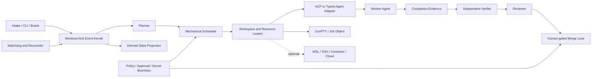

# Windows-first 맞춤형 에이전트 플랫폼 청사진

[지식 베이스 홈](./index.md) · [34개 도구 카탈로그](./tools/catalog.md) · [스키마와 작성 규칙](./knowledge-graph-schema.md)

이 문서는 [상세 오케스트레이션 기획](../planning/FAST_MULTI_AGENT_ORCHESTRATION_PLAN.md)과 [요구사항 명세](../planning/AI_AGENT_DEVELOPMENT_ENVIRONMENT_REQUIREMENTS.md)의 탐색용 의사결정 뷰다. 구현 완료 보고가 아니며 현재 상태는 설계·정적 근거 `V2`다.

## 제품 목표

한 명의 운영자가 Windows에서 Codex, Claude Code와 다른 coding agent를 빠르게 작업 큐에 넣고, 독립 작업은 격리해 병렬 실행하며, 결과를 별도 verifier가 확인한 뒤 사람 승인 아래 병합하는 local-first control plane을 만든다.

핵심 경계는 다음과 같다.

- 입력 수락, executor 시작, agent 준비, agent 완료 보고, verification 통과, review, merge를 서로 다른 event로 기록한다.
- worktree는 파일 변경만 격리한다. port, database, device, credential, process tree는 별도 `ResourceLease`로 관리한다.
- structured protocol을 우선한다. ACP/typed API가 없을 때만 PTY heuristic을 사용하고 confidence를 낮게 표시한다.
- AI coordinator는 계획을 제안할 수 있지만 ready queue, atomic claim, timeout, cancel과 merge gate의 source of truth는 기계적 kernel이다.
- local, WSL, SSH, container, cloud sandbox는 같은 executor contract를 따르되 실제 capability와 isolation 수준을 숨기지 않는다.
- agent proposal과 credential을 가진 external write/merge stage를 분리한다.

## 최소 구조

상태 저장은 SQLite WAL event store와 replay 가능한 projection으로 시작한다. UI card는 terminal 문자열이나 agent 자기보고가 아니라 process, Git, PR, CI, review, verification event를 조합한 파생값이다.

## 에이전트 역할과 권한

| 역할 | 책임 | 하지 않는 일 | 주요 참고 |
|---|---|---|---|
| Planner | 목표를 task DAG와 acceptance로 분해 | 직접 claim·merge하지 않음 | Orca, agtx, sudocode |
| Scheduler | ready 계산, atomic claim, concurrency/resource budget | 자연어 추측으로 완료 판정하지 않음 | Taskplane, Beads |
| Workspace Manager | worktree, base SHA, branch와 resource lease 수명주기 | PTY를 security sandbox로 과장하지 않음 | Emdash, Orca, Container Use |
| Worker | 격리된 범위에서 구현하고 completion report 생성 | 자기보고로 verified 상태를 만들지 않음 | Codex, Cline, OpenHands SDK |
| Verifier | worker HEAD에서 독립 명령과 evidence 수집 | 원래 worker의 성공 문구를 증거로 대체하지 않음 | 요구사항의 Evidence contract |
| Reviewer | diff, 요구사항, test와 위험을 검토 | stale head verdict를 merge gate로 사용하지 않음 | OpenHands, 외부 reviewer pilot |
| Merge Manager | fresh-base 재검증, conflict check, repo별 직렬 병합 | 검증 전 자동 병합하지 않음 | Gas Town, Taskplane |
| Watchdog/Reconciler | crash, orphan, timeout, duplicate event 복구 | 비정상 상태를 임의로 success 처리하지 않음 | Agetor, Gas Town |
| Executor Adapter | ConPTY/ACP/SSH/cloud lifecycle을 공통 contract로 변환 | 공급자 capability 차이를 숨기지 않음 | ACP, acpx, E2B, Vercel |
| Relay/Gateway | 원격·채널 요청을 provenance 있는 intake event로 변환 | coding workspace credential을 암묵 상속하지 않음 | Buzz, Hermes, OpenClaw |
| Policy | approval, egress, secret audience, retention과 write scope 검사 | 누락 policy를 permissive fallback으로 바꾸지 않음 | gh-aw, sandbox 비교 |

## 우선 로드맵

| 우선 | 기간 기준 | 결과물 | exit evidence |
|---|---|---|---|
| P0 계약·baseline | 1주 | Task/Run/Event/Resource 스키마, agent/executor adapter contract, Windows/Linux benchmark repo 3개 | schema fixture와 단일 agent baseline; 아직 runtime product 완료 아님 |
| P1 Windows local kernel | 2주 | SQLite WAL, CLI/API, Codex·Claude adapter, ConPTY/Job Object, Quick mode, staged worktree provisioning, atomic claim | Windows 실제 실행 `W2`, structured receipt, cancel과 process-tree 회수 evidence |
| P2 병렬 worktree | 2주 | DAG scheduler, dependency/resource gate, 4-agent board, isolated/shared group, Git·PR·CI projection | 20-task DAG에서 duplicate claim 0, worktree/resource collision 0 |
| P3 검증·복구 | 2주 | independent verifier, CompletionEvidence, crash reconciliation, watchdog, merge lane | false-complete, restart, orphan, fresh-base와 conflict injection 결과 |
| P4 Governed·remote | 2주 | approval/policy, WSL/SSH/Docker/E2B, secret handle, snapshot/fork, egress/retention preview, gh-aw prototype | local/cloud conformance, secret inheritance 0, tampered proposal write 100% 차단 |
| P5 hardening | 2주 | Windows long-path/CRLF/process-tree suite, adapter compatibility, chaos/DB/merge-race, telemetry/redaction | `W3` 회귀 suite와 `V5` E2E/failure-injection evidence |

순서는 기능 수보다 신뢰 가능한 상태 전이를 먼저 만든다. P1에서 `W2`가 나오기 전에는 Windows 지원을 완료로 표현하지 않고, P4 remote pilot이 성공해도 production 운영 `V6`로 자동 승격하지 않는다.

## 첫 도입과 pilot

### 바로 설계에 반영

- ACP의 version/capability/session/permission/cancel 계약
- Codex 중심 primary worker adapter와 surface별 capability profile
- Orca·Emdash의 worktree 관제와 staged provisioning
- Beads의 atomic ready/claim, Taskplane의 wave/lane, sudocode의 intent/run graph 분리
- independent verifier, evidence package, fresh-base merge lane

### 독립 pilot

- **Local orchestration**: Windows 11, Codex/Claude, 20-task DAG, 4 concurrent worktree.
- **Remote executor**: 같은 task/image를 E2B와 Vercel Sandbox에서 create/resume/fork.
- **Event automation**: gh-aw read-only agent proposal과 safe-output mock write.
- **Local container**: Container Use형 20 environment, cache invalidation, privileged/secret leakage.
- **후속 remote**: 첫 remote A/B가 통과한 뒤 Cloudflare runtime generation과 preview fencing.

Go/no-go 수치와 threat fixture는 [landscape의 pilot gate](../planning/AI_CODING_AGENT_TOOLS_AND_SERVICES_LANDSCAPE.md#81-5개-독립-pilot의-gono-go-gate)를 단일 원본으로 사용한다.

## MVP 전에 필요한 결정

1. desktop shell을 Tauri/Rust와 Electron/TypeScript 중 선택한다.
2. kernel은 Windows process 제어를 중시한 Rust와 단일 binary·PTY 생태계를 중시한 Go를 비교한다.
3. SQLite event schema를 공개 protocol로 볼지 내부 저장 형식으로 둘지 정한다.
4. MVP agent adapter는 Codex + Claude를 기본 후보로 둔다.
5. merge 기본값은 `human`으로 두고 저위험 저장소만 나중에 opt-in한다.
6. remote relay와 assistant gateway는 MVP 뒤 optional connector이며 local path의 필수 의존성이 아니다.
7. remote executor는 E2B를 첫 spike로, Vercel을 동일 suite 비교 대상으로 둔다.
8. workspace는 isolated 기본, 동일 diff의 implement-review-test만 explicit shared를 허용한다.

## 성공을 과장하지 않는 보고 규칙

- clone과 gitlink 일치: `I2`, build나 실행 증거가 아님.
- 정적 소스에서 Windows path 확인: `W1`, 실제 Windows 실행이 아님.
- agent가 작업 완료 보고: completion report, verification pass가 아님.
- test/CI green: software verification, 배포·외부 서비스·production acceptance가 아님.
- provider 문서의 isolation 주장: 해당 문서 범위의 `V1`; 설정·failure fixture 없이 보안 보장으로 승격하지 않음.
