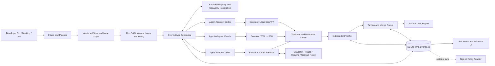

# 빠른 멀티 에이전트 실행·오케스트레이션 기획

작업명: **AIDE Fleet** (가칭)

기준일: 2026-08-14

근거: [33개 저장소 코드·GitHub 분석](./REPOSITORY_GITHUB_ANALYSIS.md), [도구·서비스 landscape](./AI_CODING_AGENT_TOOLS_AND_SERVICES_LANDSCAPE.md)

## 1. 목표

한 명의 개발자가 Codex, Claude Code, Gemini CLI, OpenCode 등 서로 다른 AI 코딩 에이전트를 **2초 안에 작업 큐에 넣고**, 독립 작업은 안전하게 병렬화하며, 결과를 증거 기반으로 검증·리뷰·병합할 수 있는 로컬 우선 개발 환경을 만든다.

핵심은 “에이전트를 많이 띄우기”가 아니다. 총 완료 시간(makespan)을 줄이면서 다음을 보장하는 것이다.

- 서로 다른 에이전트의 파일·포트·DB·프로세스 충돌 방지
- coordinator가 실제 작업보다 많은 토큰과 시간을 쓰지 않도록 제어
- 입력 수락, 프로세스 실행, 에이전트 완료, 검증 통과, 병합 완료를 분리
- 실패·중단·재시작 후 정확한 복구
- Windows 네이티브와 WSL/Linux 원격 실행을 같은 control plane에서 관리

## 2. 제품 원칙

1. **가벼운 경로가 기본**: 한 에이전트로 충분한 일은 직접 실행한다.
2. **필요할 때만 승격**: 충돌·위험·의존성이 늘면 `Quick → Parallel → Governed`로 실행 모드를 올린다.
3. **상태보다 이벤트가 원본**: 상태는 append-only event log의 projection이다.
4. **자기보고 완료를 신뢰하지 않음**: 독립 verifier의 증거 평가 후에만 `verified`가 된다.
5. **격리는 계층적**: 읽기 작업은 checkout 공유, 쓰기 작업은 worktree, 고위험 작업은 sandbox를 사용한다.
6. **병합은 단일 lane**: 구현은 병렬, 동일 저장소 병합은 검증된 순서로 직렬화한다.
7. **사람의 개입 위치를 선명하게**: 질문·권한·위험한 외부 쓰기·최종 merge만 interrupt로 올린다.
8. **의도와 실행을 분리**: spec/issue graph는 Git에, run/attempt/session event는 operational store에 둔다.
9. **상태는 파생값**: terminal 문자열이 아니라 process·Git·PR·CI·review·verification 사실로 UI 상태를 계산한다.
10. **로컬과 cloud를 한 계약으로**: executor lifecycle은 같게, isolation·network·secret·retention capability는 명시적으로 다르게 한다.
11. **연결보다 호환성이 먼저**: backend는 protocol version, usable tool, auth, agent-view service topology를 협상한 뒤에만 runnable이 된다.
12. **결정론적 작업을 우선**: 동일 변환을 script로 안전하게 표현할 수 있으면 LLM agent보다 먼저 선택하고, 판단이 필요한 step만 agent에 맡긴다.
13. **구조화된 protocol을 우선**: ACP/SDK adapter를 primary로 하고 PTY screen heuristic은 confidence가 낮은 fallback으로만 사용한다.
14. **제안과 외부 쓰기를 분리**: agent는 immutable proposal을 만들고 별도 policy/verifier/committer stage만 최소 권한으로 외부 상태를 바꾼다.

## 3. 실행 모드

| 모드 | 적용 조건 | 격리 | coordinator | 검증 | 예상 오버헤드 |
|---|---|---|---|---|---|
| Quick | 조사, 읽기, 한 파일의 저위험 수정, 작업 1개 | read-only 공유 또는 단일 worktree | 없음 또는 규칙 기반 router | 명령 1~2개 | 최소 |
| Parallel | 독립 subtask 2개 이상, 동일 repo의 분리 가능한 변경 | task별 worktree + resource lease | DAG scheduler | task별 검증 + 통합 검증 | 중간 |
| Governed | secret, 배포, migration, 외부 쓰기, 고위험 자동 병합 | container/VM/K8s sandbox | scheduler + policy engine + approval gate | 독립 verifier + reviewer + 정책 gate | 높음 |

자동 선택 규칙:

- read-only task만 있으면 Quick 공유 checkout을 허용한다.
- write task가 하나면 Quick worktree를 사용한다.
- 예상 write set이 겹치지 않는 write task가 둘 이상이면 Parallel을 제안한다.
- write set이 겹치거나 같은 generated file/schema를 만지면 의존성을 만들거나 같은 lane으로 합친다.
- destructive command, credential, deployment, production endpoint, schema migration이 포함되면 Governed로 승격하고 사람 승인을 요구한다.

## 4. 전체 구조



### 핵심 분리

- **Control plane**: task graph, policy, scheduling, event log, projections.
- **Agent adapter**: CLI별 launch/resume/input/status/transcript/evidence 변환.
- **Executor**: Windows ConPTY, POSIX PTY, WSL, SSH, Docker/Kubernetes.
- **Workspace manager**: worktree, base SHA, branch, ignored config, cache, resource lease.
- **Verifier**: 에이전트와 독립된 명령 실행과 결과 수집.
- **Merge manager**: 최신 base 재검증, conflict check, repo별 직렬 merge.
- **Intent store**: Git에 versioned spec/issue/acceptance/dependency를 보존한다.
- **Provisioning saga**: workspace의 foreground ready point와 background setup/publish를 replayable step으로 관리한다.
- **State projector**: event, Git, PR, CI, review 사실을 읽어 Board/Fleet/Evidence 상태를 계산한다.
- **Backend registry**: local·remote·cloud backend의 identity, auth mode, connection revision, health, protocol/tool capability와 agent 관점 runtime services를 관리한다.

## 5. 빠른 실행 알고리즘

### 5.1 Intake: 0~1초

사용자 요청을 다음 최소 스키마로 정규화한다.

```yaml
objective: "로그인 오류 수정"
repo: "owner/app"
risk: medium
deliverables: [code, tests]
constraints:
  allowed_paths: [src/auth, tests/auth]
verification:
  - "pnpm test auth"
merge_policy: human
```

명시되지 않은 세부 사항은 repo의 `AGENTS.md`, package scripts, CI workflow, 이전 성공 run에서 자동 추출한다. planner LLM 호출 전 cheap static discovery를 수행해 토큰을 줄인다.

### 5.2 Decomposition: 1~5초 또는 사용자 승인

다음 조건을 모두 만족하는 경우에만 subtask를 병렬화한다.

- 입력과 산출물이 한 문장으로 정의된다.
- 선행 작업 없이 시작할 수 있거나 의존성이 명시된다.
- 예상 write set 또는 resource lease가 다른 task와 충돌하지 않는다.
- 독립적인 검증 명령이 있다.
- 결과를 1~2개 commit 또는 patch로 합칠 수 있다.

권장 task 크기는 에이전트 작업 5~30분이다. 2분 미만의 미세 task는 coordinator overhead가 커지므로 묶는다. 60분 이상 task는 관찰 가능한 checkpoint 기준으로 나눈다.

### 5.3 Scheduling

ready queue 우선순위 점수:

```text
priority = critical_path_weight
         + user_priority
         + unblock_count
         - startup_cost
         - conflict_risk
         - resource_pressure
```

스케줄링 규칙:

1. DAG에서 dependency가 충족된 task만 `ready`로 만든다.
2. critical path에 있는 task와 많은 후속 task를 여는 작업을 먼저 실행한다.
3. read-only 작업은 제한 내에서 공유 checkout에 fan-out한다.
4. write task는 worktree와 branch를 원자적으로 예약한다.
5. 동일 포트·DB/schema·device·emulator는 `ResourceLease`로 충돌을 막는다.
6. 모델/API 계정별 rate limit, CPU, RAM, disk, 동시 process 예산을 가중 semaphore로 관리한다.
7. 동일 repo의 merge는 한 lane으로 직렬화하지만 verifier는 병렬 실행한다.
8. AST/regex/lockfile update처럼 deterministic transform으로 표현 가능한 task는 script executor에 먼저 라우팅하고 repository별 예외만 coding agent에 넘긴다.

초기 기본 동시성은 `min(4, available logical cores / 2, memory budget, provider quota)`로 두고 측정값으로 조정한다. 무제한 fan-out은 지원하지 않는다.

### 5.4 Provisioning 최적화

- bare mirror/object cache로 새 worktree가 object를 다시 다운로드하지 않게 한다.
- repo별 warm worktree pool을 최대 2개 유지하되 base SHA가 달라지면 재검증한다.
- dependency 디렉터리를 무조건 복사하지 않는다. package-manager cache와 lockfile hash 기반 prepared image를 사용한다.
- `.env` 값은 복사하지 않고 secret handle을 주입한다.
- worktree 생성과 agent prompt/context 준비를 병렬 수행한다.
- 포트·DB slug·emulator id를 worktree 생성과 동시에 예약한다.
- setup 결과를 `repo SHA + lockfile hash + platform + toolchain` 키로 캐시한다.

### 5.5 Dispatch 계약

에이전트 실행은 다음 receipt를 순서대로 기록한다.

1. `dispatch_accepted`: control plane이 요청을 영속화함.
2. `executor_started`: OS process/session id가 생김.
3. `agent_ready`: adapter handshake가 완료됨.
4. `task_acknowledged`: 에이전트가 task id와 제약을 읽음.
5. `progress`: 파일/도구/단계별 checkpoint.
6. `waiting_input` 또는 `waiting_dependency`: 대기 원인을 구조화함.
7. `completion_reported`: 에이전트가 결과를 제출함.
8. `verification_passed`: 독립 verifier 통과.
9. `merge_ready` / `merged`: 통합 조건 통과/실제 반영.

`agent_ready`나 terminal prompt 표시를 완료로 취급하지 않는다. `completion_reported`도 verifier 전에는 성공이 아니다.

### 5.6 진행 감시

고정 간격 전체 polling 대신 이벤트 + deadline wheel을 사용한다.

- adapter output이 있으면 progress timestamp를 갱신한다.
- 실행 유형별 silence budget을 둔다: compile/test는 예상 종료 시간을 별도로 학습한다.
- 프로세스 liveness와 semantic progress를 분리한다.
- silence timeout 시 먼저 transcript tail과 child process를 기계적으로 확인한다.
- 안전한 경우 한 번 자동 nudge, 반복 시 `needs_attention`으로 승격한다.
- process가 사라졌으면 `orphaned`로 기록하고 resume capability가 있을 때만 재개한다.
- retry는 새 `attempt_id`를 만들며 이전 evidence를 덮어쓰지 않는다.

### 5.7 Workspace grouping과 staged provisioning

planner는 task마다 격리 여부만 고르는 대신 `workspace_group`을 결정한다.

- **isolated**: 별도 배포·PR이 가능한 feature, 위험한 실험, 독립 test process는 task별 worktree/sandbox를 사용한다.
- **shared**: 같은 diff에서 구현→review→test repair가 이어지면 하나의 branch/workspace에 session을 배치한다. 동시에 두 writer를 허용하려면 path lease 또는 명시적 turn ownership이 필요하다.
- **promote**: exploration workspace의 결과를 선택하면 patch/commit을 detached verification workspace에서 dry-run한 뒤 target group으로 가져온다.

workspace 생성은 다음 saga로 기록한다.

```text
requested
  → inspected
  → base_resolved
  → workspace_materialized
  → worktree_ready       # agent launch 가능
  → dependencies_ready  # background 가능
  → services_ready      # 선택적 readiness probe
  → published           # branch/ref/metadata
```

각 step은 `started/succeeded/failed`, stage error, input hash, output reference와 idempotency key를 가진다. 재시작은 마지막 성공 step부터 이어가며, `worktree_ready` 이후 setup이 실패하면 실행 중인 agent에 structured degradation event를 보내고 정책에 따라 중단·제한 실행·재시도를 선택한다.

### 5.8 Wave/lane scheduler와 atomic claim

1. versioned issue graph를 repository segment로 나누고 dependency depth에 따라 wave를 만든다.
2. 같은 resource나 write set을 공유하는 task는 lane으로 묶어 직렬화한다.
3. ready eligibility 확인, attempt 생성, worker/workspace lease를 하나의 transaction으로 claim한다.
4. claim에는 monotonically increasing fencing token을 넣어 만료된 worker가 뒤늦게 결과를 덮지 못하게 한다.
5. critical path task는 warm workspace/snapshot과 높은 startup priority를 받는다.
6. worker context는 같은 lane 안에서 가능한 한 유지하되 task 계약과 evidence는 매번 분리한다.

### 5.9 Local/cloud 공통 executor

```text
detectCapabilities → create/get → waitReady → exec/stream → observe
                                          ↘ stop/pause → resume
                                          ↘ snapshot → fork
                                          ↘ terminate
```

- Local ConPTY는 최저 지연 경로지만 `isolation=user_process`다. ConPTY는 sandbox가 아니다.
- WSL/SSH는 별도 platform과 reconnect capability를 선언한다.
- Container Use 패턴을 참고한 local-container adapter는 환경별 branch/worktree와 container digest를 하나의 lineage로 묶는다. setup은 source mount 전에, source-dependent install은 mount 뒤에 실행하고 각 단계의 input digest·cache hit·exit code를 evidence로 남긴다.
- local-container adapter는 `runtime=dagger|docker`, host mount, socket/device passthrough, `privileged_nesting`, network mode를 capability로 광고한다. container라는 이름만으로 VM 수준 격리를 주장하지 않으며 privileged nesting이 project policy보다 강하면 fail-closed한다.
- E2B를 첫 cloud adapter로 사용해 `isolation=vm/container`, timeout, network, retention, snapshot을 계약에 노출한다.
- Vercel Sandbox를 두 번째 adapter로 추가해 persistent sandbox identity, running session, stop→snapshot, get/resume·`onResume`, fork를 E2B와 같은 suite로 비교한다. Runloop·Modal은 이후 같은 conformance suite를 통과해야 한다.
- Cloudflare Sandbox를 세 번째 후보로 두되 첫 A/B pilot의 go/no-go 뒤에 평가한다. adapter는 Durable Object control identity, container runtime generation, execution session, process/stream, service preview activation을 분리하고 restart 전 generation의 늦은 event를 fencing한다.
- self-hosted enterprise profile은 Coder식으로 agent loop와 model credential을 control plane에 두고 workspace에는 tool command만 전달한다. planning/Q&A turn은 workspace 없이 시작하고 실제 tool 실행 시점에 compute를 lazy provision한다.
- provider가 VM, egress deny, pause 같은 요청 capability를 지원하지 않으면 약한 모드로 조용히 낮추지 않고 fail-closed한다.
- snapshot은 `base_sha + lockfile_hash + toolchain + image + policy`로 key를 만들고 TTL·secret 포함 여부·생성 provenance를 저장한다.
- `executor_started`는 VM/process 존재, `executor_ready`는 authenticated command/filesystem endpoint의 probe 성공으로 구분한다. user preview server는 별도 `services_ready`다.
- control plane은 task/event/auth/placement와 routing catalog를 담당하고, PTY·file·preview traffic은 sandbox data plane으로 직접 흐르게 한다.
- remote placement는 ready node 중 best-of-K resource score를 사용하고 resume은 origin node와 snapshot/template cache locality에 가중치를 둔다.
- workload identity definition은 control plane에서 authoritative run/workspace identity에 결합하고 raw cloud credential은 sandbox에 넣지 않는다. fork는 identity와 secret lease를 기본 상속하지 않는다.
- secret 원문과 vault/env/file reference는 workspace config, Git notes, command line, stdout/stderr, snapshot에 기록하지 않는다. credential gateway가 실행 직전에 opaque handle을 resolve하고 runtime에는 short-lived secret lease만 주며 UI에는 name·audience·expiry·redaction 상태만 노출한다.
- 실패한 command 뒤 workspace/container를 보존할 수 있지만 상태는 `debuggable_failed`다. 보존된 state와 command log는 재현 evidence이고 `ready`, `completed`, `verified`의 근거가 아니다.
- remote state는 `sandbox_exists`, `session_running`, `executor_ready`, `services_ready`로 분리한다. resume hook 실패는 sandbox 손실이 아니라 service degradation이며, hook 재시도와 수동 복구 경로를 남긴다.
- persistence capability는 `ephemeral_reset | automatic_snapshot | explicit_backup_restore | persistent_volume`로 구분한다. Cloudflare식 Durable Object identity 재사용을 filesystem resume으로 오인하지 않고 idle sleep 뒤 explicit R2 backup/restore가 없으면 새 clean runtime으로 표시한다.
- idle/sleep 판단은 API call 반환이나 terminal silence가 아니라 active RPC/stream, background process, service, pending interaction과 resource lease가 모두 없는지를 기준으로 한다. remote runtime이 교체되면 durable preview token·configuration이 남아도 runtime-scoped activation과 stream owner는 새 generation에서 다시 결합한다.
- network contract는 domain/subnet destination policy와 L7 HTTP matcher·header transform·forward proxy를 별도 capability로 광고한다. provider 기본 egress가 allow-all이어도 project policy의 deny/minimal allowlist를 우선하고 예외에는 승인·범위·만료를 붙인다.
- network enforcement evidence는 HTTP/HTTPS interception과 non-HTTP/DNS path를 구분한다. Cloudflare식 outbound handler를 쓰더라도 `enableInternet=false` 또는 동등한 base deny가 확인되지 않으면 전체 egress deny로 표시하지 않는다.
- untrusted sandbox가 외부 API를 호출할 때 real credential은 control-plane/Worker proxy가 보유하고 sandbox에는 audience·TTL이 제한된 request token만 준다. proxy가 upstream 직전에 header를 주입하고 operation receipt를 반환한다.
- preview exposure는 authenticated preview URL, unauthenticated/random quick tunnel, stable named tunnel을 서로 다른 capability로 취급한다. quick tunnel은 민감 데이터에 금지하고 public URL에는 explicit approval, auth mode, TTL, hostname stability와 revocation evidence를 요구한다.
- serializable SDK handle은 provider credential을 포함하지 않는다. workflow resume 시 OIDC/workload identity로 client를 재수화하고 access token fallback은 encrypted credential gateway 안에서만 허용한다.

### 5.10 Backend federation과 capability negotiation

OpenHands/Agent Canvas에서 확인한 패턴을 공급자 중립 계약으로 축소한다.

```yaml
backend:
  id: stable-id
  kind: local | remote | cloud
  protocol_version: semver
  auth_mode: session-key | oauth | workload-identity
  connection_revision: integer
  capabilities:
    tools: [terminal, files, browser, git, child_conversation]
    lifecycle: [pause, resume, snapshot, fork]
  runtime_services:
    viewpoint: agent
    services: [{name, url, api_prefix, auth_handle}]
  health:
    transport: healthy
    compatible: true
    authenticated: true
```

- registry probe는 transport health, protocol compatibility, authentication, tool capability를 서로 다른 결과로 기록한다.
- minimum protocol보다 낮거나 version이 해석되지 않으면 fail-closed하고 upgrade reason을 표시한다.
- backend가 tool 목록을 광고하면 scheduler는 필요한 tool이 없는 run을 배치하지 않는다. 목록을 제공하지 않는 legacy backend는 별도 policy로만 허용한다.
- runtime service URL은 agent sandbox에서 실제 접근 가능한 주소여야 한다. browser 또는 host의 `localhost`를 추측하거나 port를 하드코딩하지 않는다.
- secret은 opaque lookup handle과 audience만 전달하고 backend가 spawn 시점에 해석한다. browser storage, prompt, snapshot에는 원문을 저장하지 않는다.
- 여러 backend를 전환할 때 cache와 query key에 `backend_id + connection_revision`을 포함해 이전 credential·health·conversation이 섞이지 않게 한다.
- remote warm pool은 `process_alive → dormant → initializing → executor_ready`를 별도 event로 기록한다. 사용자 workspace, session key, policy, webhook, concurrency limit이 결합되기 전에는 task를 배치하지 않는다.
- init은 backend별 lock과 generation token으로 직렬화하고, 중간 실패 시 credential·workspace partial binding을 폐기한 뒤 새 generation의 dormant 상태로 복귀한다.
- parent/child conversation은 같은 workspace identity에서만 허용하며 child의 budget, lease, evidence는 별도 attempt로 관리한다.

### 5.11 Agent protocol과 session owner

adapter는 다음 우선순위로 선택한다.

1. vendor의 typed SDK/event protocol
2. stable ACP wire protocol
3. structured JSON CLI
4. PTY/screen heuristic bridge

각 adapter는 `confidence=structured|hybrid|heuristic`, negotiated wire version, capability snapshot, provider version을 Run에 고정한다. heuristic adapter의 `stable`, prompt 표시, screen silence는 `agent_waiting`의 보조 신호일 뿐 `completion_reported`나 `verification_passed`가 아니다.

ACP connection은 initialize에서 wire major와 양방향 capability를 합의한다. 누락 capability는 unsupported로 처리하고 session/file/terminal/permission/cancellation call은 capability와 project policy를 모두 통과해야 한다. package 또는 schema release semver를 wire compatibility로 추정하지 않는다.

persistent session은 `(adapter command, absolute workspace id, optional name)`으로 찾고 live queue owner와 분리한다. owner는 다음을 가진다.

- owner-only Unix socket 또는 Windows named pipe
- cryptographically random generation token
- heartbeat, process probe, idle TTL
- prompt FIFO와 max depth
- cooperative `session/cancel`, timeout 후 scoped process-tree kill

owner가 죽으면 같은 provider session에 `resume/load`를 시도한다. 실패해 새 session이 필요하면 Quick mode에서도 새 `attempt_id`를 만들고 continuity loss를 표시하며, Governed mode에서는 자동 fallback하지 않고 승인받는다. raw ACP NDJSON은 보존하되 UI projection은 schema version과 message sequence를 사용한다.

### 5.12 Compiled automation manifest와 scoped write stage

GitHub Agentic Workflows의 source→lock workflow와 safe-output 패턴을 local/cloud 공통 실행 계획으로 일반화한다.

```text
Spec/Markdown + policy
  → parse/schema validate
  → resolve adapter/action/image digests
  → permission/network/MCP validation
  → immutable ExecutionManifest
  → read-only agent stage
  → proposal artifact
  → deterministic sanitizer/policy
  → optional isolated threat detector
  → verifier/human gate
  → scoped external committer
```

- `ExecutionManifest`는 source hash, compiler/schema version, base SHA, engine/adapter, resolved dependency digest, stage DAG, permission, network, secret audience, budgets와 expiry를 포함한다.
- 동일 source·policy·registry snapshot은 동일 manifest hash를 내야 한다. 외부 version resolution이 달라지면 새 manifest revision으로 취급한다.
- update compiler는 trusted base ref의 이전 manifest와 새 manifest를 비교해 permission, network/MCP reachability, secret audience, sandbox host access, external write, dependency pin의 privilege diff를 만든다. working-copy manifest는 approval baseline으로 쓰지 않는다.
- privilege가 넓어지는 diff는 manifest 재생성만으로 승인되지 않는다. policy gate 또는 명시적 approver와 만료를 요구하고, 축소는 자동 허용하되 audit event를 남긴다.
- agent stage에는 repository/issue 읽기와 artifact write만 주고 Git push, issue/PR mutation, deployment 같은 권한은 주지 않는다.
- proposal artifact는 typed schema, 수량·크기·path 제한, secret redaction, content hash를 통과해야 한다. AI threat detector는 보조 signal이고 deterministic validation을 대체하지 않는다.
- external committer는 operation별 최소 scope와 short-lived credential을 받아 manifest에 허용된 mutation만 수행하고 resulting external id/SHA와 delivery receipt를 event log에 돌려준다.
- GitHub Actions/gh-aw는 issue·PR·schedule trigger용 remote execution profile로 통합한다. deterministic build/test/deploy workflow는 agentic lane으로 바꾸지 않는다.

## 6. 권장 멀티 에이전트 팀 구성

작업마다 고정된 5-agent 팀을 만들지 않는다. 역할은 필요할 때만 활성화한다.

| 역할 | 생성 조건 | 책임 | 쓰기 권한 |
|---|---|---|---|
| Router/Planner | task가 복합적이거나 불명확 | repo discovery, DAG, acceptance criteria | 기본 read-only |
| Implementer | 독립 write task마다 1개 | 제한된 path에서 구현·자체 테스트 | 자신의 worktree |
| Researcher | 외부 문서/호환성/설계 조사 필요 | evidence와 선택지 제공 | read-only |
| Verifier | code/config 변경이 있음 | 독립 명령 실행, evidence 생성 | 테스트 산출물만 |
| Reviewer | 위험 중간 이상 또는 merge 후보 2개 이상 | diff, security, maintainability 검토 | comment only |
| Merger | repo lane에서 1개 | base refresh, conflict, integration test, merge | merge 전용 |

### 예시: API + UI 기능

```text
Planner
├─ T1 API 계약/구현 ───────┐
├─ T2 UI 구현 ─────────────┼─ T4 통합 테스트 ─ T5 Review ─ Merge
└─ T3 테스트 fixture 조사 ┘
```

- T1과 T2는 계약을 먼저 동결한 뒤 병렬 실행한다.
- T3는 read-only로 즉시 시작해 T1/T2에 메시지를 보낼 수 있다.
- T4는 T1/T2가 `verification_passed`일 때만 ready가 된다.
- reviewer는 전체 transcript가 아니라 diff, task contract, verification evidence만 읽어 context 비용을 줄인다.

## 7. Context와 통신 최적화

### Context pack

각 agent에 전체 repo/전체 대화를 전달하지 않는다.

```yaml
task_contract: objective + constraints + acceptance
base: repo + sha + branch
scope: allowed/read-only/forbidden paths
interfaces: selected symbols and contracts
history: relevant decisions only
verification: commands and expected artifacts
budget: tokens/time/cost
```

Context pack은 content hash로 저장하고 중복 agent가 같은 immutable 부분을 재사용한다. 후속 메시지는 full prompt가 아니라 `task_id`, `event_seq`, 변경된 delta만 보낸다.

### Typed message

자유 텍스트는 `note`로 유지하되 제어 흐름은 다음 타입을 사용한다.

- `dispatch`, `ack`, `progress`, `checkpoint`
- `question`, `answer`, `approval_request`, `approval_decision`
- `dependency_ready`, `contract_changed`
- `completion_report`, `verification_result`, `review_result`
- `merge_ready`, `escalation`, `cancel`, `heartbeat`

모든 메시지에는 `message_id`, `run_id`, `task_id`, `attempt_id`, `sender`, `recipient`, `created_at`, `reply_to`, `dedupe_key`를 포함한다.

## 8. 완료·검증·병합

### CompletionEvidence

```json
{
  "base_sha": "...",
  "head_sha": "...",
  "changed_paths": ["src/a.ts"],
  "commits": ["..."],
  "commands": [{"argv": ["pnpm", "test"], "exitCode": 0}],
  "tests": {"passed": 42, "failed": 0},
  "artifacts": ["artifact://run/.../test-report"],
  "limitations": [],
  "agent_claim": "implemented and tested"
}
```

승격 규칙:

- `completion_reported`: agent claim 수신.
- `verified`: verifier가 현재 head에서 필수 명령을 재실행하고 결과 hash를 기록.
- `review_approved`: review policy 충족.
- `merge_ready`: 최신 target base에 대한 conflict check와 required check 충족.
- `merged`: Git ref/PR 상태를 다시 읽어 실제 반영을 확인.

소프트웨어 검증은 외부 시스템·배포·물리 장치 동작 증명과 분리한다. 배포나 장치 검증은 별도 environment evidence가 없으면 `pending_external_verification`으로 남긴다.

### AI reviewer evidence

Copilot Review, CodeRabbit, Qodo, Greptile 같은 서비스는 reviewer adapter로 연결하되 review comment를 verification이나 approval로 승격하지 않는다.

- ReviewRun은 provider, reviewed head/base SHA, mode/full-or-incremental, capability, instruction·rule·code-graph revision, started/completed time을 가진다.
- finding은 stable fingerprint, path/line, category/severity/confidence, evidence, suggested fix, provider comment id와 `open|accepted|dismissed|false_positive|fixed|stale` 상태를 가진다.
- 새 commit이 올라오면 영향 path의 finding과 review verdict를 stale로 만들고, merge gate가 요구하면 새 head에서 re-review한다.
- 서로 다른 reviewer의 중복·모순을 합치되 원본 verdict를 지우지 않는다. LLM 다수결은 correctness proof가 아니다.
- accepted finding은 수정 Run과 연결하고 fixed 여부는 새 diff·test·re-review로 판정한다. dismissed/false-positive feedback은 provider별 precision·noise 지표에 반영한다.
- GitHub Copilot의 `COMMENT` review처럼 provider가 approval을 제공하지 않는 경우 policy가 이를 human approval로 해석하지 못하게 capability에서 고정한다.

### Merge queue

- repo별 queue는 기본 FIFO이며 security/hotfix만 명시적 우선순위를 허용한다.
- merge 직전에 target base를 fetch하고 base SHA가 바뀌면 integration verifier를 재실행한다.
- 자동 conflict resolution은 생성 파일/lockfile 같은 정책 허용 범위에서만 수행한다.
- 동일 파일의 의미 충돌은 사람 또는 merger agent에 escalation한다.
- 실패한 merge는 worktree/branch를 보존하고 recoverable 상태로 둔다.

## 9. UI/운영 경험

기본 화면은 3개면 충분하다.

1. **Graph/Board**: task dependency, critical path, blocked 이유.
2. **Fleet**: agent/process 상태, 마지막 progress, 비용·시간·resource lease.
3. **Evidence/Review**: diff, command 결과, 질문·승인, merge gate.

상태 색만 사용하지 않고 텍스트와 원인을 함께 표시한다.

```text
T2 UI implementation
RUNNING · 03:42 · Codex · wt/ui-auth
Last evidence: edited src/Auth.tsx 8s ago
Blocked by: none
Next gate: pnpm test auth-ui
```

interrupt inbox는 `질문`, `승인`, `실패`, `merge 준비`만 모은다. 일반 progress는 알림을 보내지 않는다.

## 10. 성능 목표와 측정

| 지표 | MVP 목표 | GA 목표 |
|---|---:|---:|
| CLI task 영속화/ack p95 | 500ms | 250ms |
| warm Quick agent launch p95 | 3초 | 2초 |
| warm worktree 준비 p95, setup 제외 | 5초 | 3초 |
| event UI 반영 p95 | 1초 | 500ms |
| 8개 동시 agent에서 control-plane CPU | 평균 10% 이하 | 평균 5% 이하 |
| crash 후 projection/reconciliation | 30초 | 10초 |
| 완료 이벤트 유실 | 0 | 0 |
| false-complete 비율 | 2% 미만 | 0.5% 미만 |
| 자동 복구 가능한 orphan 회수율 | 80% | 95% |

핵심 제품 지표:

- 단일 agent 대비 전체 makespan 감소율
- coordinator time/token 비율
- agent별 useful work 시작 시간
- merge conflict 및 rework 비율
- `completion_reported → verified` 실패율
- 사람 interrupt 수/작업
- stale/false waiting/false done 비율
- provider/model별 성공률·비용·재시도율

### 10.1 Assistant Gateway Connector와 surface profile

- Codex의 exec·TUI·app-server와 Cline의 IDE·CLI·hub는 각각 별도 `capability_profile`로 등록한다. 제품 이름이나 binary 존재만으로 resume, approval, tool, sandbox capability를 추정하지 않는다.
- Hermes/OpenClaw의 channel request는 `AssistantGatewayConnector`가 durable task-intake event로 변환한다. `sender_identity`, `workspace`, `credential_audience`, `sandbox_profile`은 하나의 원자적 binding으로 저장한다.
- binding이 누락·만료·불일치하면 fallback 권한으로 실행하지 않고 fail-closed한다. gateway의 personal memory·cron·companion node trust domain은 coding workspace와 별도 policy domain으로 유지한다.

## 11. 개발 단계

### Phase 0 — 계약과 benchmark, 1주

- task/run/agent/resource 상태 분리
- event schema와 adapter contract 동결
- Windows/Linux 공통 benchmark repo 3개 준비
- 단일 agent baseline 측정
- spec/issue graph와 run/event graph 경계 정의
- local/cloud executor capability matrix와 threat model

### Phase 1 — Local kernel, 2주

- SQLite WAL event store와 projection
- CLI/API, Codex/Claude adapter 각 1개
- Windows ConPTY + POSIX PTY executor
- Quick mode, structured receipts, transcript capture
- staged provisioning saga와 `worktree_ready` 조기 반환
- atomic ready/claim과 fencing token

### Phase 2 — Parallel worktree, 2주

- DAG scheduler, dependency gate, resource semaphore
- worktree/base SHA/branch manager
- port/DB slug lease
- 4-agent parallel board와 cancel/retry
- wave/lane/polyrepo segment와 shared/isolated workspace group
- Git·PR·CI·review 기반 state projector
- 선택형 local-container executor, branch/worktree/container lineage와 setup/install cache telemetry

### Phase 3 — Evidence and recovery, 2주

- verifier, CompletionEvidence, review gate
- crash reconciliation, orphan/resume, deadline watchdog
- repo별 merge queue와 conflict precheck

### Phase 4 — Governed and remote, 2주

- policy/approval engine
- Docker/WSL/SSH/E2B executor
- secret handle, sandbox profile, signed optional relay
- snapshot/fork warm pool, pause/resume, egress/retention preview
- compiled execution manifest, read-only proposal stage와 scoped external committer
- GitHub Actions/gh-aw connector prototype과 safe-output conformance fixture
- secret reference·command output·Git notes·snapshot leakage fixture와 privileged-nesting policy test

### Phase 5 — Hardening, 2주

- Windows process-tree/CRLF/long-path 회귀 시험
- adapter version compatibility matrix
- chaos/restart/DB corruption/merge race 시험
- telemetry opt-in, redaction, performance tuning

## 12. 주요 위험과 대응

| 위험 | 영향 | 대응 |
|---|---|---|
| 지나친 fan-out | 비용·충돌·review backlog | concurrency budget, write-set conflict, critical path 우선 |
| CLI 출력 변경 | 상태 탐지 오류 | structured protocol 우선, versioned adapter, heuristic은 degraded 표시 |
| agent 자기보고 오판 | false complete | independent verifier와 merge-time recheck |
| worktree 외 자원 충돌 | dev server/test 실패 | ResourceLease로 port/DB/device 격리 |
| coordinator 자체 정지 | 전체 stall | mechanical scheduler가 source of truth, AI coordinator는 제안/계획 역할 |
| Windows process 고아화 | 자원 누수·삭제 실패 | Job Object, process-tree ownership, target-scoped cleanup |
| secret 노출 | 보안 사고 | opaque handle, redaction, least privilege, event payload 금지 |
| 자동 merge 회귀 | main 손상 | protected merge lane, fresh-base verification, rollback-ready branch |
| 라이선스 혼합 | 배포 제약 | clean-room 구현, dependency/license SBOM gate |
| cloud sandbox 종속 | 비용·outage·이식성 | 공통 executor contract, conformance suite, export 가능한 evidence |
| unrestricted egress | source/secret 유출 | deny/allowlist profile, setup/MCP 예외 범위 표시, opaque secret gateway |
| snapshot 오염·stale | 재현 불가·secret 잔존 | provenance/TTL/invalidation key, secret-free snapshot policy |
| shared workspace 동시 write | diff 손실·race | single writer 기본, path lease 또는 explicit turn ownership |
| status projection drift | 잘못된 관제 판단 | event replay, source별 freshness, unknown/degraded fail-closed |

## 13. 의사결정 게이트

MVP 착수 전 다음을 결정한다.

1. Desktop shell: Tauri/Rust 또는 Electron/TypeScript.
2. Kernel 언어: Rust(Windows/process/성능) 또는 Go(단일 binary/PTY 생태계).
3. SQLite event schema를 공개 protocol로 볼지 내부 구현으로 둘지.
4. 첫 번째 agent adapter 조합: Codex + Claude 권장.
5. 자동 merge 기본값: MVP에서는 `human`, 이후 저위험 repo만 opt-in 권장.
6. remote relay: MVP 이후 optional adapter로 두며 로컬 경로를 막지 않는다.
7. 첫 remote executor: E2B adapter를 spike로 채택하고 Runloop/Modal은 conformance 결과로 결정한다.
8. workspace grouping: isolated 기본, 동일 diff의 implement-review-test만 explicit shared를 허용한다.
9. task state backend: MVP는 SQLite 단일 writer, 조직 동시 writer는 Dolt/PostgreSQL adapter로 분리한다.
10. snapshot retention과 egress 기본값: secret-free snapshot, outbound deny 또는 최소 allowlist를 권장한다.

상세 기능·비기능·인수 조건은 [신규 도구 요구사항](./AI_AGENT_DEVELOPMENT_ENVIRONMENT_REQUIREMENTS.md)에 정의한다.
